# JavaScript学习

# JS初识

---

## 代码规范问题

---

JS是由java衍生出来的，而java又是由C语言衍生出来的，所以JS的大部分语法和C语言差别不大；但JS的产生是为了前端人员方便使用的，所以这门语言最开始的设计十分随意，和Python有点像，但随着用的越来越多，这随意的问题就暴露出来了，所以后面推出了TypeScript语言对它进行规范和升级，并正在取代JS语言。

## 结果输出

---

- `document.write()` 直接在页面输出
- `console.log()` 在控制台输出
- `alert()` 弹框输出

## 大小问题

---

JS对大小写敏感，使用时一定要注意

## 文件外部导入方式

---

和CSS文件一样，JS也支持从外部导入，但不是使用`link` 标签了，而是`<script src=”<文件位置>”> </script>` ，`<script>...</script>` 是一个严格的双标签，少了另一半就无法正常使用。

## JS数据类型概览

---

### 变量

在JS中，全部变量都以`var` 关键字来定义，变量的命名规则和其他语言一样（不能数字打头，不能以奇怪的符号打头…）

### 数字

在JS中，不区分整数还是小数，统一叫做`number` 

```jsx
123 //整数
123.1 //浮点数
1.123e2  //科学计数法
-99 //负数
NaN  //Not a number
Infinity  //无穷大
```

### 字符串

与C++一样，使用`""` 或者`''` 定义一个字符串类型

### 布尔值

true, flase

### 逻辑运算

```jsx
&& //与
|| //或
! //非
```

### 比较运算符

```jsx
= //赋值符号
==  //值相等，但是类型不一样(1 == "1")
===  //值一样，类型也一样
```

**注意：**

- `NaN` 不与任何人相等，和它自己也不行，只能使用`isNaN()` 函数进行判断
- 精度问题，由于计算机不接受无穷小数，所以只能会进行表达，这样就导致了很多分数的判断是错误的，比如1/3 === （1 - 2/3）本来应该是正确的，但是无穷小数在被简化之后，使得结果不再相等。*解决办法：如果两者相减小于一个很小的数就认为它们相等*

### null和undefined

- 空值为null，为定义的值报错为undefined

### 数组（JS中的数组内元素不要求类型相等）

```jsx
var arr  [1, 2, 3, "Hello", null, undefined];
```

访问规则也是使用`arr[index]`

### 对象（object，类似字典）

使用大括号表示

```jsx
var person = {
    "name": "Landon",
    "age": 20,
    "tags": ["student", "coder", "monitor"],
}

console.log(person["name"])
// object数据也可以使用person.name进行对象值的访问
```

## JS代码规范

---

既然有着不规范的缺点，那么JS想了一种办法去尽可能的增加代码的规范性，使用`'use strict'` 这句话去严格规范变量定义

正常情况下，JS可以直接写`i = 1` ，但是这样定义的i直接是全局变量，太不严谨了，项目中的JS文件有很多，这样瞎写全局变量会导致严重的修复问题，在使用`'use strict'` 之后，这样的代码会直接报错，不允许运行

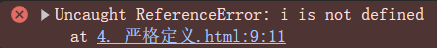

**注意：**

- 这句话一定要写在JS第一行检查才生效
- 局部变量定义方法最推荐的是`let` 或者使用`const` 定义常量
- JS定义了：**同一作用域内不能重复声明同名变量**

## 类型检查

---

在JS中，有两种常见的检查函数

- `console.log(typeof num)` ，检查num变量的数据类型
    - 注意：typeof只能检查出最基本的数据类型（历史遗留问题），复杂的类型只输出：`Object`
- `console.log(num instanceof Number)`，检查`num` 变量是否为Number类型

## 类型转换

---

### 将字符串转换为数字

- 使用`Number()` 函数，只能转化 *数字型* 字符串
- 使用`parseInt()` 函数，将字符串中的整数提取出来并转化为整数，只能将首字符是数字的字符串进行数字提取并转化，如果不是会返回`NaN`
- 使用`parseFloat()` 函数，将字符串中的整数与浮点数提取出来并转化为整数与浮点数，只能将首字符是数字的字符串进行数字提取并转化，如果不是会返回`NaN`

```jsx
// 使用Number转换数字类型
let num = "123";
console.log(Number(num) + 123);  // 返回246

// 转化非数字类型字符串
let str = "abc123"
document.writeln(Number(str) + "<br/>");  // 返回NaN，非数字型字符串

// 使用parseInt转化
let num_1 = "123.12abc";
document.writeln(parseInt(num) + "<br/>");  //输出为123

// 只能检测打头的几个数字，无法检测到之后的
let num_2 = "123abc123"
document.writeln(parseInt(num_2) + "<br/>");  //输出为123

// 使用parseFloat转化
let num_3 = "123.12abc";
document.writeln(parseFloat(num_3));  // 输出为123.12

```

### 将数字转化为字符串

- 任何数字加上一个字符串都会变为一个字符串，所以可以使用数字加空字符的形式转化
- 使用`.toString()` 方法

```jsx
// 使用toString方法转化数字
let a = 2018;
let b = "1011";
document.writeln(a.toString() + b);  // 输出为20181011
```

# JS数据类型详解

---

## 字符串

---

1. 多行字符串编写（使用反引号``` ，允许字符串换行显示）

```jsx
let textArea = `
多行文字1
多行蚊子2
`
```

1. 转义字符（`\`）

```jsx
// JS中的字符串不仅支持原来的\n, \t 还允许加入HTML标签，例如："<br/>"同样表示换行
\u####  // Unicode编码也可以显示
\x41  //ASCII编码也可以显示
```

1. 模板字符串（使用`${<变量名>}` ，支持将外部函数值放入函数打印中）

```jsx
// 使用模板字符串
let customer = "Landon";
document.writeln(`你好呀！${customer + " the coder"}`);
```

**注意：**一定要使用多行字符串符号``` 才可以实现模板字符串效果，引号不行


1. 获得字符串长度`.length` （属性，不需要使用括号调用）
2. 字符串的不可变性，所有操作都不会对原字符串进行修改，而是返回新实例

```jsx
// 字符串的不可变性
document.writeln(customer[0] = "J")  // 不可变，单独返回一个J
document.writeln(customer)  // 依然是 Landon
```

1. 修改大写(`toUpperCase()`)，修改小写（`toLowerCase()`），都不改变原格式


1. 获取特定字符的索引值：`indexOf("<字符>")` ，使用`lastIndexOf("<字符>")` 用来返回一个字符最后一次出现的索引；如果不存在，则返回-1


1. 获得子字符串：`substring(start_index, end_index)` ，左闭右开

```jsx
// 获取特定索引号的字符串
console.log(customer.substring(customer.indexOf('Lan'), customer.indexOf('n')+1))
```

---

以下不常用，为拓展用法

1. 获取特定索引的字符串：`.charAt(<索引号>)` ，用的更多的是`string[index_num]` 
2. 替换字符串：`.replace("旧字符串", "新字符串")` ，此方法也支持**正则表达式**匹配与替换！如果不使用正则表达式，那么只会默认修改找到的第一个值，可以通过`/…/g` 实现全局搜索和替换
3. 使用`.split("<指定字符>")` 让元素以指定元素为分割，构成数组；特殊分割字符：`””` 可以将字符按照单个单词进行分割！

## 数组

---

1. 获取数组长度：`.length` 
2. 获取元素索引：`.indexOf("<指定元素>")` 
3. **数组切片：**`.slice(<始>, <终>)` ，返回一个新数组
4. 与其他数组拼接：`.concat(<数组>)` 
5. 将数字内元素按指定符号进行拼接，返回修改后字符串：`.join("<指定符号>")`
6. 支持多维数组

以下操作会直接在原数组上修改

1. 从**尾部***添加、删除*元素：`.push()` ，`.pop()` 
    1. push方法会返回添加新元素后的长度
    2. pop方法会返回弹出的元素
2. 从**头部***添加、删除*元素：`unshift()` ，`.shift()` 
    1. unshift方法会返回添加新元素后的长度
    2. shift方法会返回弹出的元素
3. 数组排序：`.sort(<可填入排序函数>)` 
4. 元素反转：`.reverse()`

## 对象Object类型

---

1. 基本形式

```jsx
let var = {
		键: 值,
		键: 值,
		键: 值
}
```

**注意：**JS中，所有键都会默认转化为**字符串**类型，不用显示定义也可以，并且最后一个键值对不建议添加逗号，可能引发兼容性问题

1. 对象赋值

```jsx
let person = {
		name: "Landon",
		age: 20,
		schoole: "SHU"
}

person.score = "良好";  // 或者person["score"] = "良好"
```

1. 获取对象中属性：`person.name` 或者`person["name"]` 均可
2. 删除对象中的属性：`delete person.name` 
3. 判断对象中是否有此属性：`'name' in person` 
4. 判断一个属性是对象特有的，还是继承于父类的（准确来说为是否为实例的直接属性，或者是通过原型获得（类定义或者类继承，反正不是通过`this` 指定的））：`person.hasOwnProperty('age')` ，是`this`的返回true，反之,false

```jsx
class Basic {
  constructor(name) {
    this.name = name;
  }

  showName() {
    console.log(`Hello! My name is ${this.name}.`);
  }
}

class First extends Basic {
  constructor(name, age) {
    super(name);
    this.age = age;
  }

  showAge() {
    console.log(`My age is ${this.age}`);
  }
}

class Second extends First {
  static NAME = "First";
  constructor(name, age, hobby) {
    super(name, age);
    this.hobby = hobby;
  }

  showHobby() {
    console.log(`My hobby is ${this.hobby}. What about you?`);
  }

  static getName() {
    console.log(Second.NAME);
  }
}

let test = new Second("zzzongzii", 10, "code");
console.log(test.hasOwnProperty("showHobby"));  // false
console.log("showHobby" in test);  // true
```

# 流程控制

---

JS中的流程控制和C++基本相同（switch，while，for，if…），只讲解几个特殊的

```jsx
    switch (x){
        case 1: console.log("星期一");
        break;
        case 2: console.log("星期二");
        break;
        default: console.log("不知道");
    }
```

1. `forEach` 函数，类似于python中的`map` 函数，将可迭代对象中的每一个值都放入定义好的函数中进行执行并获得输出


1. `for(let sub in array){...}` ，`sub`中存储了可迭代元素中每一个元素的**索引值**


1. `for(const value of iterable{...})` ，value储存了可迭代元素中的**值**

# Set对象与Map对象

---

## Map对象（字典）

---

JS中的Map对象可以被当作一个类似与“字典”的东西，与Object不同，它没有属性的概念，只是单纯一个字典类型，因此它的键可以不止为字符串，允许函数、数组等作为键。

```jsx
// 创建一个map对象
let map = new Map([["Landon", 100], ["Alice", 90], ["Jack", 80]]);
console.log(map);  // Map { 'Landon': 100, 'Alice': 90, 'Jack': 80 }

// 获取其中元素
console.log(map.get("Landon"));   // 100

// 向其中添加元素
map.set("Tom", 87);
console.log(map);
// 使用链式调用插入多个元素
map.set("Lucky", 60)
    .set("fuck", 59);
console.log(map);

// 删除其中元素
map.delete("Tom");
console.log(map);
```

**注意：**Map数据只能通过`.get()` 获取数据与`.set()` 加入新数据，使用`.delete()` 删除键值对；并不能像Object那样加入数据或者修改数据。

## Set对象（集合）

---

与其他语言中的集合一样，Set类型数据不允许重复数据的出现

```jsx
// 声明一个Set对象
let mySet = new Set([1, 2, 1, 1, 1])
console.log(mySet);

// 向其中添加数据
mySet.add(3);
console.log(mySet);

// 从其中删除元素
mySet.delete(2)
console.log(mySet);

// 判断其中是否存在某个元素
console.log(mySet.has(1));

// 使用Set数据去除Array中重复元素
let set = new Set([1, 1, 2, 2, 1, 3]);
console.log(set);
let myList = Array.from(set);
console.log(myList);

// 使用拓展运算符
console.log([...set]);
```

**总结：**

- 获取元素：
    - Map：`.get()`
    - Set：`.has()`
- 添加元素：
    - Map：`.set()`
    - Set：`.add()`
- 删除元素：
    - 都为`.delete()`

**补充：**拓展运算符（`...`）在JS中的作用与`*` 和`**` 在python中的作用差不多，都是负责可迭代数据的解包操作~

# 数学对象

---

## 数学属性

---

**一些常用常数：**

- `Math.PI` 表示圆周率
- `Math.SQRT2` 表示根号2
- `Math.SQRT1_2` 表示根号二分之一

```jsx
// 尝试数学 Math 常量
// * 圆周率
console.log(Math.PI);
// * 根号2
console.log(Math.SQRT2);
console.log(Math.SQRT1_2);
// * 表示角度
console.log(120 / 180 * Math.PI);  // 通过这种办法，可以方便查看以角度制表示的角度
```

## 数学函数

---

```jsx
// * 最大最小值，要求输入为使用序列拓展符拓展后的数
let lst = [5, 2, 1, 3, 4];
console.log(Math.max(...lst));
console.log(Math.min(...lst));

// * 尝试向下向上取整
console.log(Math.floor(3.99));
console.log(Math.ceil(3.01));

// * 给出 0-1 随机数
console.log(Math.random());
console.log(Math.random() * 20);  // 生成 0-20 的随机数
console.log(Math.random() * 0.7 + 3.300001);  // 生成 3.3-4.0 之间的数

// * 给出任意范围内的整数
console.log(Math.floor(Math.random() * 10 + 1));  // 0-10 内整数
console.log(Math.floor(Math.random() * 91) + 10);

// * 其他不常用函数
console.log(Math.abs(-15));  // 求绝对值
console.log(Math.pow(2, 3));  // 求 2 ^ 3
console.log(Math.sqrt(2));  // 求根号2
console.log(Math.exp(2));  // 求 e^2
```

### `Math.random()` 取随机数详解：

- `Math.random()` 取的是范围在`[0-1)` 之内的随机数

**场景一：取出[a, b)之间的随机数（包括小数）**

代码：`Math.random() * (b - a) + a;`

**场景二：  取出[a, b]之间的整数**

代码：`Math.floor(Math.random * (b - a + 1)) + a;` 

# Date对象

---


默认返回的时间格式是ISO，可以将其进行格式转化：


# 函数操作

---

### **1️⃣ JavaScript 的函数提升（Hoisting）**

- 在 JavaScript 中，**函数声明会被提升到作用域的顶部**，这意味着无论函数定义出现在代码的哪个位置，JavaScript 引擎都会在执行代码前将函数声明“提到”作用域的顶部。不过，当存在 **同名函数的多次声明** 时，最后一次的声明会覆盖前面的声明。

## 非匿名函数

---

```jsx
function showDate(x) {
  switch (x) {
    case 1:
      console.log("星期一");
      break;
    case 2:
      console.log("星期二");
      break;
    default:
      console.log("不知道");
  }
}

showDate(2);
```

## 匿名函数

---

```jsx
// 使用匿名函数
let abs = function (x) {
  console.log("函数中参数的个数为:", arguments.length);

  if (x >= 0) {
    return x;
  } else {
    return -x;
  }
};

console.log(abs(-2));
```

## JS中函数的随意性

---

```jsx
// JS中函数的随意性(不填参数不会报错)
console.log(abs());  // 返回NaN，但不报错

// 填过多的参数不会报错(只对第一个参数进行函数操作)
console.log(abs(-1, 2, 1, 2, 3));  // 返回1，也不报错
```

为了解决这种问题，我们只能手动`throw` 一个错误提醒：

```jsx
// 函数中自带的 arguments 属性
function add(x, y) {
  if (arguments.length === 2) {
    console.log(`${x}与${y}的值相加结果是:${x + y}`);
  }

  // * 抛出异常提醒
  else if (arguments.length < 2) {
    throw "Too less arguments!";
  } else {
    throw "Too many arguments!";
  }
}
```

- `arguments` 参数可以保存用户输入函数的全部参数

## 使用拓展符号`...` 来接收任意数量的输入

---

类似于python的`*arg` ，JS提供`...rest` 来存储接收预料之外的参数输入（rest为一个数组）

```jsx
function test(x, y, ...rest) {
  console.log("函数接受的多余参数有:", rest);  // [3, 4, 5]
}

test(1, 2, 3, 4, 5); 
```

注意：与python一样，`...rest` 也只能写在函数参数的最后

## 函数的替代性

---

在JS中，一个函数再次被定义之后，原来的定义的函数会完全失效，请看下面的例子

```jsx
"use strict";

function add(x, y) {
  console.log("这是第一个add函数");
  console.log(`${x}与${y}相加的结果是:${x + y}`);
  return x + y;
}

add(1, 2);

// * 重新定义一个 add 函数，原函数会被直接替换掉
function add(a, b) {
  console.log("这是第二个add函数");
  console.log(`${a}与${b}相加的结果是:${a + b}`);
}

add(3, 4);
```


从Quokka的颜色块可以看出，原来的add函数没有被调用过，并且输出全是在第二个add中；

## 函数的作用域问题

---

### 变量的存取

**在外部函数定义的变量，内部函数可以拿到；但是在内部函数定义的变量外部函数拿不到**

```jsx
"use strict";

// * 函数外部定义的内部可以用，内部定义的外部拿不到
function outer() {
  let out = "x";
  function inner() {
    let _inner = "y";
    console.log(_inner + out);  // "xy"
  }
  inner();
  console.log(`inner中的变量是${_inner}`);
}

	outer();  // ReferenceError: _inner is not defined

```

### **变量提升(Hoist)操作**

在JS中，一个函数在调用前首先会被整体扫描一遍，这样它其实知道内部有哪些变量，所以它会隐式地将变量的声明给提前，这样就带来的一个“好处”：你明明是在后面定义的变量，你在前面错误使用了也不会报错！


为了解决这个问题，我们有`let` 与`const` 这两种声明方式，这两种声明方式虽然也会隐式地将变量的声明给提前但是，它们会自动生成一个“死区”，死区中的变量在定义或者声明之前是严格不可以调用的，这样就避免了先使用变量后定义变量的疑惑问题；使得全部的变量在使用之前都必须先声明


### **全局`window`概念**

在JS中，所有的全局变量都会默认存储到一个`window` 的全局空间（对象）中，我们可以通过`window` 来判断一个变量的作用域


这样的全局变量会引发问题，如果有好几个不同的成员写的代码，结果用了一样命名，这样就会产生冲突（函数被重写，`var`变量重赋值，`let`变量直接报错）发生报错，在实际的实践中，大家都会先默认创建一个对象，作为自己代码的“局部作用域”，之后全部的变量声明和定义都放入这个局部作用域中

```jsx
// * 唯一的全局变量（充当全局变量管理员）
var zzzongzii = {};
zzzongzii.name = "Landon";  // 将变量加入自己的局部作用域中进行封装
console.log(zzzongzii.name);  // "Landon"
// 定义函数
zzzongzii.add = function (x, y) {
  console.log("和为:", x + y);
};
let result = zzzongzii.add(1, 2); // 和为:3
```

但这样也会有一个问题，就是像alert这类的全局函数，我们被允许对它进行修改

```jsx
alert(1);
window.alert(2);
info = window.alert;
info(3);  // 弹出3
window.alert = {};  // 重写alert
alert(4);  // 报错，显示alert不是一个函数，无法被调用
```

### 拓展：`let` 声明变量与`var` 声明变量的区别

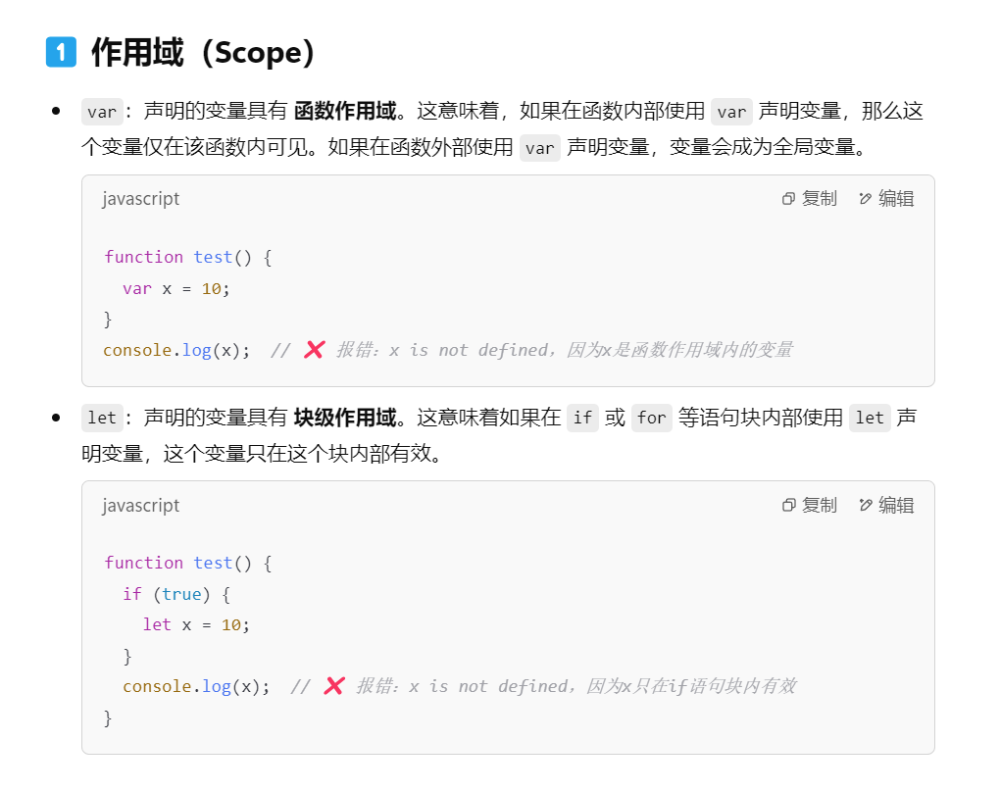

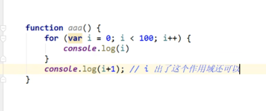

**var定义的变量是函数作用域，在函数中声明的变量在整个函数都可以用**

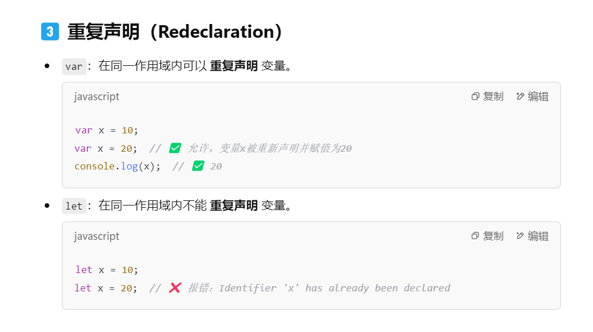

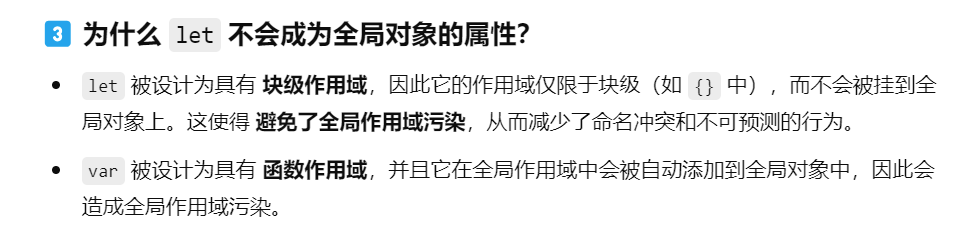

在实际运用中，我们只使用`var` 定义一个对象作为全局变量的管理空间，其他的都用`let` 定义来避免作用域污染问题~

## `apply` 方法与`this` 关键字

---

### `this` 关键字

```jsx
var zzzongzii = {
  name: "Landon",
  birth: 2004,
  age: function () {
    let year = new Date().getFullYear();
    return year - this.birth;
  },
};

console.log(zzzongzii.age()); // 返回21
```

在JS中，this关键字**默认指向调用函数的那个对象**，并从对象中获取相应数值（在这里是指向zzzongzii）

```jsx
function getAgg() {
  let year = new Date().getFullYear();
  return year - this.birth;
}

var Landon = {
  birth: 2024,
  age: getAgg,  // 这里Landon对象主动调用了gerAgg()，所以this指向Landon，返回1
};
```

### `apply` 与`call`方法

为了更好控制函数中`this` 指向的对象，我们可以使用apply与call方法手动设置指向的对象

```jsx
func.call(thisArg, arg1, arg2, ...);  // 直接传入参数
func.apply(thisArg, [argsArray]);  // 使用列表传入函数所需参数，空参数的传递用空数组[]
```

```jsx
// * apply 与 call
var zzzongzii = {
  name: "zzzongzii",
};

var Landon = {
  name: "Landon",
};

function greeting(country) {
  console.log(`Hello! My name is ${this.name} and I'm from ${country}`);
}

// 使用apply(使用列表传入函数参数)
greeting.apply(Landon, ["USA"]);  // 'Hello! My name is Landon and I\'m from USA' 

// 使用call(直接传入参数)
greeting.call(zzzongzii, "China");  // 'Hello! My name is zzzongzii and I\'m from China'
```

# JSON字符串

---

- JSON实际上就是一种特殊的字符串，负责前后端数据的传输，可以将JS中的类型无缝转化为JSON，也可以将JSON无缝转化为JS类型进行处理
    - `{}` 表示对象
    - `[]` 表示数组
    - `键:值` 表示内部数据存储格式


**重点方法：**

1. `stringify(<JS对象>)` 将JS转化为JSON形式
2. `parse(<JSON字符串对象>)` 将JSON转化为JS形式

## 不同的请求方式

---

- 原生的js写法，xhr异步请求
- jQuery封装好的方法，`$(”<选择器>”).ajax(””)`
- axios请求（最专业）

# 面向对象编程

---

老方法⬇️

## 继承方法

---

补充：

- **定义：** `__proto__` 是 **每个实例对象的内部属性**（非标准，但被大多数现代浏览器支持），指向创建该对象的构造函数的 `prototype` 对象。
- **作用：** 用于建立对象与其原型之间的链接，形成原型链，帮助实现继承和属性查找机制。如果一个方法在实例中找不到，就会沿着`__proto__` 定义的原型链去`__proto__`指向的那个对象中去查找并执行

---

```jsx
"use strict";

// * 定义一个对象
let landon = {
  name: "Landon",
  run: function () {
    console.log(`${this.name} is running...`);
  },
};

// * 再定义另一个对象
let kimi = {
  name: "kimi",
};
console.log(kimi);
kimi,run();  // 报错

// * 让kimi继承landon的奔跑
kimi.__proto__ = landon; // 设置kimi的‘模板’是landon
kimi.run();  // kimi is running...

```

在使用`__proto__` 设置的原型链的时候，子类属性的值会先使用子类中的重写后的属性，除非没写，才会沿着`__proto__` 设置的原型链，使用父类的值

## 创建模板（类）

---

**使用构造函数（首字母大写）按照模板创建实例对象**

```jsx
// * 使用构造函数创建一个对象，并设置继承关系
function Student(name) {
  this.name = name; // this指向调用函数新增的对象，并给新增对象新增name属性
}

let zzzongzii = new Student("zzzongzii");
console.log(zzzongzii);

let landon = new Student("landon");
console.log(landon);
```

使用`new` 关键字会新建一个对象，而构造函数中的`this` 会默认指向这个新建的对象，并为这个对象按照构造函数逻辑设置内部属性；

**为创建的实例对象新增方法或属性**

1. 直接修改原构造函数`Student` ，JS会自动找到后面这个重写的Student的构造函数，并将之前写的构造函数给替换掉(JS中的函数提升)

```jsx
// 修改构造函数Student
function Student(name) {
  this.name = name; // this指向调用函数新增的对象，并给新增对象新增name属性
  this.grade = 100;
  this.greeting = function () {
    console.log(`Hello, My name is ${this.name}`);
  };
}
```

1. 可以直接修改Student的`prototype` 来修改由Student创建的实例（推荐）

---

补充：

- **定义：** `prototype` 是 **构造函数（Function）** 的属性，指向一个对象，这个对象包含了所有由该构造函数创建的实例所共享的方法和属性。
- **作用：** 用于定义实例可以继承的属性和方法，相当于选中全部由构造函数构造的实例并统一添加新属性或者方法
- **与__proto__的联系：**`__proto__`说明了这个实例对象有哪些属性和方法是继承于父类的，而`protype` 说明了父类有哪些属性和方法被子类继承。**`__proto__` 说明了实例对象的继承来源（即它继承自哪个父类的 `prototype`），而 `prototype` 则定义了父类能够提供给子类继承的属性和方法。**

```jsx
Person (构造函数)
   └── prototype（定义共享方法） 
         └── greet()
               ↑
             __proto__ （实例指向原型）
               ↑
          person1（实例对象）
```

---

这个方法新增的属性和方法严格遵守撰写的顺序，一定要先修改中由Student创建的实例的属性，子类的属性才会发生变化

```jsx
// 修改父类的父类
Student.prototype.greeting = function () {
  console.log(`Hello, My name is ${this.name}`);
};
Student.prototype.grade = 100;
```


新方法⬇️

## 使用类来初始化属性（最佳实践）

---

既然Student是一个类，那么我们就应该用`class` 来声明并初始化，在ES6之前，对于类的初始化和增加属性只有上面的老方式，在ES6之后，新增了真实的**类**的概念。并且在类中，**不需要通过function关键字声明这是一个函数**

```jsx
// * 使用class来定义一个类
class Student {
  // 初始化属性(使用构造函数 constructor 来统一初始化属性，在之后直接写方法定义即可，甚至不用function)
  constructor(name) {
    this.name = name;
  }

  // 添加方法，不需要通过function关键字声明这是一个函数
  greeting() {
    console.log(`Hello, My name is ${this.name}`);
  }
}

let zzzongzii = new Student("zzzongzii");
zzzongzii;
zzzongzii.greeting(); // 'Hello, My name is zzzongzii'

let landon = new Student("landon");
landon;
landon.greeting();

// * 给对象新增属性或者方法
zzzongzii.score = 100;
zzzongzii.showScore = function () {
  console.log(`My score is ${this.score}`);
};
zzzongzii;
zzzongzii.showScore();  // 'My score is 100'
```

## 类的继承(extends)

---

```jsx
// * 类的继承 extends
class AdvancedStudent extends Student {
  constructor(name, tag) {
    super(name); // 一定要先调用父类的构造函数，子类的this是引用父类的this指向的实例的，不然子类无法使用 this 关键字
    this.tag = tag;
  }

  // 重写方法
  greeting() {
    super.greeting();  // 调用父类的方法
    console.log(`Hello, My name is ${this.name} and my tag is ${this.tag}`);
  }
}

let LandonZhang = new AdvancedStudent("LandonZhang", "awesome");
LandonZhang.greeting();  // 'Hello, My name is LandonZhang and my tag is awesome' 'Hello, My name is LandonZhang'
```

**注意：**

- 在使用继承时，子类的构造函数constructor要首先使用`super(<参数>)` 函数为父类进行初始化，因为在继承当中，子类并不直接拥有`this` 指向实例，而是继承的**父类创建`this` 指向实例，然后子类通过父类的`this` 指向实例并访问属性或方法**
- 使用`super` 关键字可直接指向父类，并可通过`super.<>` 访问父类的方法或属性

## 新方法和属性的添加

---

### 静态属性 static（包括属性和方法）

- 静态属性的设计理念：静态成员是属于类本身的，不属于具体的实例。它们通常用于存储与类相关的全局信息，而不是与某个特定对象相关的数据，所以这类数据并不能直接通过类的实例来访问，而是通过类名来访问
- 当在类外部使用`className.para = ... className.f = function(){...}` 定义时，新增的都是这个类的静态属性和方法，类的实例无法访问~

```jsx
class Student {
  // 静态属性：用于记录创建的 Student 实例数量
  static count = 0;

  constructor(name) {
    this.name = name;
    // 每次创建新实例时，计数器 +1
    Student.count++;
  }

  // 静态方法：获取当前实例数量
  static getStudentCount() {
    return Student.count;
  }

  greeting() {
    console.log(`Hello, my name is ${this.name}`);
  }
}

// 创建几个 Student 实例
const student1 = new Student("Landon");
const student2 = new Student("Alice");
const student3 = new Student("Bob");

// 通过类名获取实例总数
console.log(Student.getStudentCount()); // 输出: 3

// ❌ 实例无法访问静态属性或方法
console.log(student1.count);           // undefined
// student1.getStudentCount();         // 报错: 不存在此方法
```

从以上示例可以看出，count和getStudentCount是关于类的信息，类的实例没有必要去访问它，也不能访问它。

### 添加类的属性和方法

**错误实践**

```jsx
// ! 错误实践：直接给 Student 增加方法和属性，并在实例中访问调用
Student.school = "UNKNOWN";
Student.showSchool = function () {
  console.log(`My school is ${this.school}`);
};
console.log(zzzongzii.school);  // undeefine
```

**`school` 被设置为Student类的静态属性了，不允许被实例所访问**

**正确实践**

- 直接向父类的`prototype` 传入新的属性和方法，子类的`__proto__` 会组成原型链在父类的`prototype` 中寻找

```jsx
Student.prototype.school = "SHU";
Student.prototype.showSchool = function () {
  console.log(`My school is ${this.school}, nice to meet you!`);
};
console.log(zzzongzii.school);  // 'SHU'
console.log(zzzongzii.showSchool())  // 'My school is SHU, nice to meet you!'
```

### 类中其他常见的关键字与作用

**`get` 和 `set` - 访问器属性**

- **作用：** 定义对象的访问器属性，可以**像访问属性一样调用方法**。
- **特点：** `get` 用于获取属性值，`set` 用于设置属性值。

```jsx
class Student {
  constructor(name) {
    this._name = name; // 私有属性命名习惯
  }

  get name1() {
    // ✅ get 关键字
    return this._name;
  }

  set name2(value) {
    // ✅ set 关键字
    if (value.length < 2) {
      console.log("Name is too short!");
    } else {
      this._name = value;
    }
  }
}

const student1 = new Student("Alice");
console.log(student1.name1); // 调用 getter，输出: Alice
console.log(typeof student1.name1); // 类型为'string'

student1.name2 = "Bo"; // 调用 setter
console.log(student1.name1); // 输出: Bo
console.log(typeof student1.name2);  // name2已经不算一个函数了，返回undefine类型
```

**`#` - 私有属性（Private Fields）**

- **作用：** 定义**类**的私有属性或方法，只能在定义它的类内部访问，无法通过实例或子类直接访问。
- **特点：** 这是 ES2022 的新特性，使用 `#` 符号声明私有属性。

```jsx
class Student {
  #privateField = "Secret"; // 私有属性

  // 定义方法进行访问
  getSecret() {
    return this.#privateField;
  }
}
const student1 = new Student();
console.log(Student.#privateField);  // 访问报错
console.log(student1.getSecret()); // 输出: Secret
```


**`_` - 受保护属性（Protected Field）**

- **设计理念：** 受保护属性（通常使用 `_` 命名前缀）**旨在属于实例的属性**，但同时允许子类访问，**不建议外部代码直接访问**
- **访问规则：**子类可以访问，但外部代码应该避免直接访问（只是约定，非强制性）

```jsx
class Parent {
  constructor(name) {
    this._name = name;  // 受保护属性（属于实例）
  }

  getName() {
    return this._name;
  }
}

class Child extends Parent {
  showName() {
    return this._name;  // 子类可以访问受保护属性
  }
}

const child = new Child("Landon");

console.log(child.showName());  // 输出: Landon
console.log(child._name);       // 不推荐，但外部仍然可以访问
```

**总结：共有属性、保护属性、静态属性、私有属性**

- 共有属性就是“裸奔”，子类可以看，实例可以看，谁都可以看
- 保护属性是“君子约定”，大家也能看，但是最好不要看，请通过其他办法看
- 静态属性很“小气”，只允许子类看，实例不准看
- 私有属性最“害羞”，只有定义的类能看，其他的一概不能看

# 操作BOM对象

---

**概念：**BOM全称Browser Object Model浏览器对象模型，将浏览器的各个组成部分封装成对象。

**对象组成：**

- Window：窗口对象
- Navigator：浏览器对象
- Screen：显示器屏幕对象
- History：历史记录对象
- Location：地址栏对象

## Window对象

---

window代表窗口对象

```jsx
window.alert("<message>")  // 控制浏览器弹出弹窗
window.innerHeight  // 返回浏览器显示内容范围的高度（不包括开发者工具的尺寸）
window.innerWidth  // 返回浏览器显示内容范围的宽度（不包括开发者工具的尺寸）
window.outerWidth  // 返回整个浏览器窗口的宽度
window.outerHeight  // 返回整个浏览器窗口的高度
```

## Navigator对象

---

navigator代表浏览器对象

```jsx
navigator.appName  // "Netscape"  返回浏览器名称
navigator.appVersion  // 检测浏览器版本 
// '5.0 (Windows NT 10.0; Win64; x64) AppleWebKit/537.36 (KHTML, like Gecko) Chrome/132.0.0.0 Safari/537.36'
navigator.userAgent  // 返回用户使用的浏览器详细信息
// 'Mozilla/5.0 (Windows NT 10.0; Win64; x64) AppleWebKit/537.36 (KHTML, like Gecko) Chrome/132.0.0.0 Safari/537.36'
```

## Screen对象

---

代表电脑屏幕尺寸

```jsx
screen.width  // 1920px
screen.height // 1080px
```

## Location对象

---

表示当前页面的URL详细信息

| **属性** | **作用** | **示例值** |
| --- | --- | --- |
| `href` | 完整 URL | `https://www.example.com:8080/path/page.html` |
| `protocol` | 协议部分 | `https:` 或 `http:` |
| `host` | 主机名 + 端口号（如果有） | `www.example.com:8080` 或 `www.example.com` |
| `hostname` | 主机名（不包含端口） | `www.example.com` |
| `port` | 端口号 | `8080` 或 `""`（默认端口时为空） |
| `pathname` | 路径部分 | `/path/page.html` |
| `search` | 查询字符串（包括 `?`） | `?query=123` |
| `hash` | 哈希值（包括 `#`） | `#section` |
| `origin` | 协议 + 域名 + 端口（不包含路径和参数） | `https://www.example.com:8080` |

---

**页面跳转的实际应用** 

- **使用 `href` 跳转：**

```jsx
location.href = "https://www.google.com"; // 页面跳转到 Google
```

- **使用 `assign()`（推荐方式）：**

```jsx
location.assign("https://www.google.com"); // 类似于修改 href，但可以保留历史记录
```

- **使用 `replace()`（不会保留历史记录）：**

```jsx
ocation.replace("https://www.google.com"); // 替换当前页面，无法使用后退按钮返回
```

## Document对象

---

document代表当前页面的文档数，通过JS操作网页就是操作DOM对象

```jsx
// 修改网页title
document.title  //显示
document.title = "Hello, Landon";  // 修改标签显示

// 获取网页cookie
document.cookie  // 设置cookie: httpOnly可以避免cookie被截获

// 获得具体的文档数节点
document.getElementByID(<字符串值>)
document.getElementsByClassName(<字符串值>)
document.getElementsByTagName(<字符串值>)
document.getElementsByName(<字符串值>)  // 按照键值对的键值寻找文档树节点
```


## History对象

---

history代表页面访问的历史记录，可以实现网页回滚和网页前进

```jsx
history.back() // 回滚
history.forward()  // 前进
```

# 操作DOM对象

---

当使用JavaScript操作文档树的时候，一定要确保文档树已经加载完成，否则无法选择对应元素或节点!

## 获得DOM节点

---

- 在 HTML 中，**空白字符（如换行符、空格、缩进）也被视为文本节点（Text Node）**，即 `#text`，多个空白字符会被视作一个文本节点
- 如果要直接获得HTML标签，在语言中叫做**元素节点（Element）**

```html
<!DOCTYPE html>
<html lang="en">
  <head>
    <meta charset="UTF-8" />
    <meta name="viewport" content="width=device-width, initial-scale=1.0" />
    <title>Document</title>
  </head>
  <body>
    <dl id="firstTry">
      <dt>This is a define list:</dt>
      <dd>value 1</dd>
      <dd>value 2</dd>
      <dd>value 3</dd>
    </dl>

    <div class="father">
      <h1>一级标题</h1>
      <p>一段文字</p>
      <p>两段文字</p>
      <p>三段文字</p>
    </div>

    <script>
      // * 获得文档树节点
      let lst = document.getElementById("firstTry"); // 使用ID获得节点
      let father = document.getElementsByClassName("father"); // 使用类名称获得节点
      let h1 = document.getElementsByTagName("h1");
      let child = father[0].children; // 获得全部的元素集合 HTMLCollection
      let fc = father[0].firstElementChild;
      let lc = father[0].lastElementChild;
      let cn = father[0].childNodes; // 获得全部的结点集合（包括文本结点） NodeList
    </script>
  </body>
</html>
```

**注意：**函数中带着Elements的都是获得一个元素或者节点的集合，需要通过下标来获得具体的元素或节点。`.children` 可获得全部子元素结点，`.childNodes` 获得全部子节点（文本与元素）

## 更新节点

---

```html
<div id="id1">

</div>

<script>
	var id1 = document.getElementById("id1");
</script>
```

**操作文本：`id.innerText = “A new line”`** 修改节点内文本值

**操作HTML标签：`id.innerHTML = "<strong>A strong text</strong>"`** 可以解析HTML文本标签

**操作CSS：**

```html
id1.style.color = "red";  // 修改样式的值一定要用双引号包裹
id.style.fontSize = "20px";  // 驼峰命名法
id.style.padding = "2em";
```

原始数据：

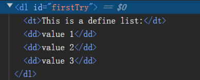

执行操作：

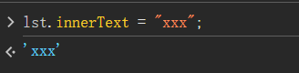

更新后结果：

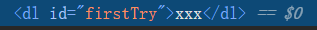

## 删除节点

---

删除节点的步骤：先通过`parentElement`获取父元素，再通过父节点的`removeChild` 方法删除自己

```
<!DOCTYPE html>
<html lang="en">
  <head>
    <meta charset="UTF-8" />
    <meta name="viewport" content="width=device-width, initial-scale=1.0" />
    <title>Document</title>
  </head>
  <body>
    <div class="father">
      <h1>一级标题</h1>
      <p>一段文字</p>
      <p>两段文字</p>
      <p>三段文字</p>
    </div>

    <script>
      let father = document.getElementsByClassName("father"); // 使用类名称获得节点
      let child = father[0].children; // 获得全部的元素集合 HTMLCollection
      let fc = father[0].firstElementChild;
      
      // 删除fc元素
      // 方法一：
      father[0].removeChild(fc);
      
      // 方法二：
      let tf = fc.parentElement;
      tf.removeChild(tf);
    </script>
  </body>
</html>
```

## 插入节点

---

1. 使用`append` 插入

插入节点和删除节点一样，都是基于父标签的，所以要先定位父标签，再使用`appendChild(<节点>)` 进行结点的插入

```jsx
// 获取元素
    var div=document.getElementById("div1");
    // 创造元素，给元素添加些文字
    var p=document.createElement("p");
    p.innerHTML="添加1";
    var p1=document.createElement("p");
    p1.innerHTML="添加2";
    var p2=document.createElement("p");
    p2.innerHTML="添加3";
    // 添加到div中
    div.appendChild(p);
    div.appendChild(p1);
    div.appendChild(p2);
```

**`appendChild`与`append`的选择和使用：**

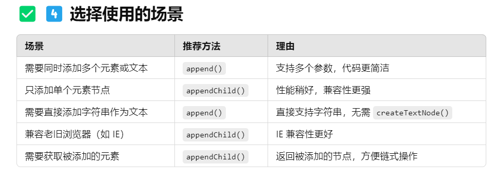

```jsx
var p=document.createElement("p");
p.innerHTML="添加1";
var p1=document.createElement("p");
p1.innerHTML="添加2";
var p2=document.createElement("p");
p2.innerHTML="添加3";
father[0].append(p, p1, p2);
```

1. 使用`insertbefore` 插入

`append` 方法只能将标签插入到标签的最后，但如果想精确控制插入标签的位置，可以使用`obj.inserBefore(node, existingnode)` 表示的是在指定的已有子节点之前插入新的子节点。node表示要添加的节点，existingnode表示在其之前插入新节点的子节点。

```jsx
// 创造元素，给元素添加些文字
var p=document.createElement("p");
p.innerHTML="添加1";
var p1=document.createElement("p");
p1.innerHTML="添加2";
var p2=document.createElement("p");
p2.innerHTML="添加3";
// 添加到div中
father[0].appendChild(p);
father[0].insertBefore(p1,p);
father[0].insertBefore(p2,p1);
```


## 创建结点

---

我们可以使用JS平地起高楼，创建一个HTML标签，随后再使用上述方法进行插入，使得结点发挥作用。

**注意：**新建结点只有在被插入文档树的时候才会被显示

```jsx
var a = document.createElement("a");  // 创建一个a标签
// 使用对象的方法加入属性
a.href = "https://www.google.com";
a.target = "_self";
// 使用setAttribute方法加入属性
a.setAttribute("href", "https://www.baidu.com");
a.setAttribute("target", "_self");
```

# 操作表单

---

- 使用`.value` **获得值或者修改值**

```jsx
<!DOCTYPE html>
<html lang="en">
  <head>
    <meta charset="UTF-8" />
    <meta name="viewport" content="width=device-width, initial-scale=1.0" />
    <title>Document</title>
  </head>
  <body>
    <div id="user_info">
      <form action="#" method="post" class="form">
        <span>用户名:</span> <input type="text" />
        <br />
        <span>性别:</span>
        <input type="radio" name="sex" value="box" />男
        <input type="radio" name="sex" value="girl" />女
      </form>
    </div>

    <script>
      let text = document.getElementsByClassName("form")[0].children[1];
      text.value; // 获得框中输入值
      text.value = "zzzongzii";
    </script>
  </body>
</html>

```

- 像radio等已经明确定义了`value` 属性的节点，我们通过`value` ，我们通过value只能获得写死的值，不能获得用户输入的值；这个时候需要通过`checked` 属性来判断用户的选择情况并决定传入给后端的值；也可以设置`checked` 属性用来控制选中

```jsx
<!DOCTYPE html>
<html lang="en">
  <head>
    <meta charset="UTF-8" />
    <meta name="viewport" content="width=device-width, initial-scale=1.0" />
    <title>Document</title>
  </head>
  <body>
    <div id="user_info">
      <form action="#" method="post" class="form">
        <span>用户名:</span> <input type="text" />
        <br />
        <span>性别:</span>
        <input type="radio" name="sex" value="box" />男
        <input type="radio" name="sex" value="girl" />女
      </form>
    </div>

    <script>
      let radio_boy = document.getElementsByName("sex")[0];
      let radio_girl = document.getElementsByName("sex")[1];
      // 获取
      radio_boy.checked;
      radio_girl.checked;
      // 设置
      radio_boy.checked = true;
    </script>
  </body>
</html>

```

## 验证输入值与输入md5加密

---

我们可以使用`onlick` 属性将函数绑定在标签上，也可以使用`onsubmit` 将函数绑定在表单的提交上，在标签被点击时或者表单提交时启动函数进行判断，设置`onsubmit="return function()"` 可以将`return false` 的表单不提交

```html
<!DOCTYPE html>
<html lang="en">
  <head>
    <meta charset="UTF-8" />
    <meta name="viewport" content="width=device-width, initial-scale=1.0" />
    <title>Document</title>
    <style>
      input {
        margin: 20px;
      }
      #submit {
        margin-left: 10px;
      }
    </style>
    <script src="https://cdn.bootcss.com/blueimp-md5/2.10.0/js/md5.min.js"></script>
  </head>
  <body>
    <div class="user_info">
      <!--绑定函数在表单提交上 -->
      <form
        action="../操作表单/index.html"
        method="post"
        onsubmit="return seek()"
      >
        <span>用户名:</span>
        <input type="text" id="username" name="username" />
        <br />
        <span>密码:</span>
        <!-- <input type="password" id="password" name="password" /> 老版标签-->
        <input type="password" id="looking" />
        <br />
        <input type="hidden" name="password" id="password" />
        <!--绑定“点击”事件 -> onclick="seek()-->
        <input type="submit" id="submit" onclick="check()" />
      </form>
    </div>

    <script>
      function seek() {
        let name = document.getElementById("username").value;
        let pwd = document.getElementById("password").value;
        if (name.length <= 0) {
          alert("输入的用户名过短!");
          return false;
        } else {
          alert("提交成功!");
          return true;
        }
      }

      // 使用md5算法加密用户输入
      function check() {
        alert("check开始");
        let wrapper = document.getElementById("looking");
        let pwd = document.getElementById("password");
        pwd.value = md5(pwd.value);
      }
    </script>
  </body>
</html>
```

- 以上使用了一个hidden的input隐藏真实的密码提交，使得密码在提交时不会突然变长影响体验

# jQuery操作

---

**jQuery的使用公式：`$("选择器").<检测的操作/状态>(<执行的函数>)`** 

## jQuery选择器

---

jQuery的选择器规则和CSS基本一样，一样有基本选择器，伪类选择器，结构选择器…

```html
<!DOCTYPE html>
<html lang="en">
  <head>
    <meta charset="UTF-8" />
    <meta name="viewport" content="width=device-width, initial-scale=1.0" />
    <title>Document</title>
    <script src="jquery-3.7.1.min.js"></script>
  </head>
  <body>
    <div>
      <a href="#" id="test_jQuery">点我试试看！</a>
    </div>
    
	  <script>
			// * 测试jQuery的使用: $("选择器").action()
      $("#test_jQuery").click(function () {
        alert("hello, jQuery");
      });
    </script>
  </body>
</html>

```

## jQuery事件绑定与事件冒泡

---

### 事件冒泡

---

在jQuery中，如果一个操作是在子元素内发生的，这个操作不仅仅在子元素中生效，还会通过事件冒泡影响到父级元素

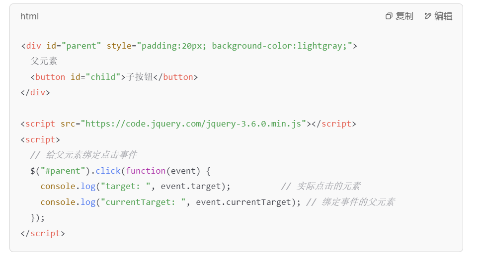

在上面这段代码中，我们只给父元素绑定了click动作监视器，但是如果我们在子按钮上click的话，这个click动作不仅仅停留在子元素中，**还会向父级传播**，直至传到DOM为止，如果你的父元素不幸也监视了click动作的话，你点击子元素，父元素也会执行相应的操作，就导致了行为的混乱，为了避免这个问题，我们通常使用`event.stopPropagation()` **阻止事件的向上传播**

```jsx
$("#child").click(function (event) {
  event.stopPropagation(); // 阻止事件冒泡
  console.log("子按钮被点击！（冒泡已阻止）");
});
```

### 事件绑定

---

- 文档树在jQuery中被简化为`document` 关键字，在很多情况下，我们的JS文件需要等待 DOM 完全加载完才执行，所以我们首先需要对`document`进行状态监视

```jsx
// 老写法
$(document).ready(function() {
  console.log("文档已加载完成（老写法）");
});

// 新写法->一定要传入一个函数，只是公式中省略了选择器和事件绑定，函数还是要写的
$(function() {
  console.log("文档已加载完成（简化写法）");
});

```

- 不管是监视的任何事件，只要发生了，就会产生默认的一个`event` 对象，这个对象记录了事件触发的详细信息（鼠标位置，事件类型，按下了哪一个键），这个对象可以传入执行函数中作为参数，方便在执行函数中提供信息

```jsx
<!DOCTYPE html>
<html lang="en">
  <head>
    <meta charset="UTF-8" />
    <meta name="viewport" content="width=device-width, initial-scale=1.0" />
    <title>Document</title>
    <script src="jquery-3.7.1.min.js"></script>
    <style>
      #position {
        border: 2px dashed red;
        height: 100px;
      }
    </style>
  </head>
  <body>
    <div
      id="mousedown-box"
      style="
        width: 200px;
        height: 100px;
        background-color: red;
        text-align: center;
      "
    >
      <span style="line-height: 100px">按下鼠标</span>
    </div>

    <span id="info"></span>
    <br />
    <div style="margin: 20px" id="position"></div>

    <script>
      // 监控鼠标移动事件并获得坐标
      /*
      1. 确保元素完全加载完成再执行操作
      2. 填入具体操作
      */
      $(function () {
        $("#position").mousemove(function (event) {
          $("#info").text("坐标:(" + event.pageX + "," + event.pageY + ")"); // 添加文本信息显示
        });
      });
    </script>
  </body>
</html>

```

**`event` 核心信息：**

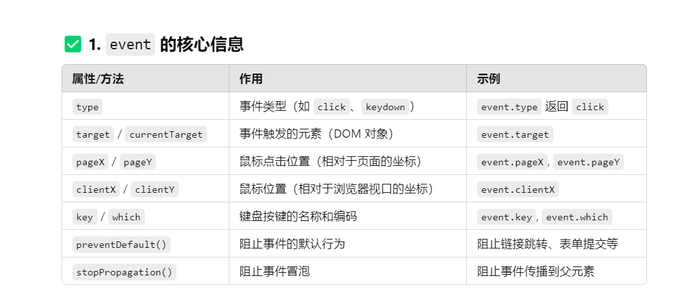

- `event.preventDefault()` 实验

```jsx
<!DOCTYPE html>
<html lang="en">
  <head>
    <meta charset="UTF-8" />
    <meta name="viewport" content="width=device-width, initial-scale=1.0" />
    <title>Document</title>
    <script src="template/jquery-3.7.1.min.js"></script>
  </head>
  <body>
    <!-- 禁用 a 标签的跳转行为 -->
    <div class="href">
      <span>
        <a href="https://www.baidu.com" id="a">点我试试看！</a>
      </span>
    </div>

    <script>
      $(function () {
        $("#a").click(function (event) {
          event.preventDefault();  // 点击之后a标签没反应
        });
      });
    </script>
  </body>
</html>
```

- `event.stopPropagation()` 实验

```jsx
<!DOCTYPE html>
<html lang="en">
  <head>
    <meta charset="UTF-8" />
    <meta name="viewport" content="width=device-width, initial-scale=1.0" />
    <title>Document</title>
    <script src="template/jquery-3.7.1.min.js"></script>
  </head>
  <body>
    <!-- 实验组织事件的向上传播 -->
    <div class="father">
      <button>快按我!</button>
    </div>

    <script>
      // 绑定父类行为
      $(function () {
        $(".father").click(function (event) {
          // event.stopPropagation();
          alert("父类被点击!");
          $(this).text("为什么点我?呜呜呜~");
          $(this).css({ border: "2px dashed red", background: "skyblue" });
        });
      });

      // 绑定子类行为
      $(function () {
        $(".father button:first-child").click(function (event) {
          alert("子类被点击");
        });
      });
    </script>
  </body>
</html>
```

**结果：**点击之后父类弹出警告，样式改变

```jsx
<!DOCTYPE html>
<html lang="en">
  <head>
    <meta charset="UTF-8" />
    <meta name="viewport" content="width=device-width, initial-scale=1.0" />
    <title>Document</title>
    <script src="template/jquery-3.7.1.min.js"></script>
  </head>
  <body>
    <!-- 实验组织事件的向上传播 -->
    <div class="father">
      <button>快按我!</button>
    </div>

    <script>
      // 绑定父类行为
      $(function () {
        $(".father").click(function (event) {
          // event.stopPropagation();
          alert("父类被点击!");
          $(this).text("为什么点我?呜呜呜~");
          $(this).css({ border: "2px dashed red", background: "skyblue" });
        });
      });

      // 绑定子类行为
      $(function () {
        $(".father button:first-child").click(function (event) {
          alert("子类被点击");
          event.stopPropagation();  // 阻止向上传播
        });
      });
    </script>
  </body>
</html>
```

**结果：**仅仅弹出子类警告，父类没反应

**注：**`which` 已经被废弃

**target和currentTarget的区别：e**

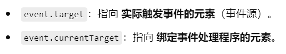

这个参数就是为了区分，事件的触发到底是有子元素冒泡上来的，还是确实是由绑定事件处理程序的元素触发的，最稳定的情况是：`event.current.Target=event.target` （没有冒泡，‘冤有头债有主’）

**常用监视事件：**

### **1. 鼠标事件（Mouse Events）**

| **事件名称** | **描述** |
| --- | --- |
| `click` | 当鼠标点击元素时触发 |
| `dblclick` | 当鼠标双击元素时触发 |
| `mousedown` | 当鼠标按下（不松开）时触发 |
| `mouseup` | 当鼠标按键松开时触发 |
| `mousemove` | 当鼠标在元素上移动时触发 |
| `mouseover` | 当鼠标移到元素上方时触发 |
| `mouseout` | 当鼠标移出元素区域时触发 |
| `mouseenter` | 当鼠标进入元素区域时触发（不冒泡） |
| `mouseleave` | 当鼠标离开元素区域时触发（不冒泡） |
| `contextmenu` | 当鼠标右键点击元素时触发 |

---

### 📋 **2. 键盘事件（Keyboard Events）**

| **事件名称** | **描述** |
| --- | --- |
| `keydown` | 当按下键盘上的任意键时触发 |
| `keypress` | 当按下键盘上的字符键时触发（已废弃） |
| `keyup` | 当松开键盘上的任意键时触发 |

---

### 🖼️ **3. 表单事件（Form Events）**

| **事件名称** | **描述** |
| --- | --- |
| `focus` | 当元素获得焦点时触发 |
| `blur` | 当元素失去焦点时触发 |
| `change` | 当表单元素的值发生变化时触发 |
| `submit` | 当表单提交时触发 |
| `reset` | 当表单被重置时触发 |
| `select` | 当文本被选中时触发 |
| `input` | 当用户输入内容时触发（适用于 `input` 和 `textarea`） |

---

### 📦 **4. 文档和窗口事件（Document & Window Events）**

| **事件名称** | **描述** |
| --- | --- |
| `load` | 当页面或资源加载完成时触发（已废弃） |
| `resize` | 当窗口大小调整时触发 |
| `scroll` | 当滚动条滚动时触发 |
| `unload` | 当页面卸载或刷新时触发（已废弃） |
| `ready` | 当 DOM 完全加载完成时触发 |

---

### 🔄 **5. 剪贴板事件（Clipboard Events）**

| **事件名称** | **描述** |
| --- | --- |
| `copy` | 当用户复制内容时触发 |
| `cut` | 当用户剪切内容时触发 |
| `paste` | 当用户粘贴内容时触发 |

---

**详细事件参考文档：**[https://www.jq22.com/chm/jquery/index.html](https://www.jq22.com/chm/jquery/index.html) （事件太多了，全部掌握不现实，查找文档即可）

---

### `this` 选择器

---

`${this}` 可以选中当前触发”监视动作“的元素标签，之后可以使用`.text()` 添加文本，或者`.css()` 修改样式~

```jsx
<!DOCTYPE html>
<html lang="en">
  <head>
    <meta charset="UTF-8" />
    <meta name="viewport" content="width=device-width, initial-scale=1.0" />
    <title>Document</title>
    <script src="jquery-3.7.1.min.js"></script>
    <style>
      #position {
        border: 2px dashed red;
        height: 100px;
      }
    </style>
  </head>
  <body>
    <input
      type="text"
      id="focus-blur"
      placeholder="点击获得焦点，点击外部失去焦点"
    />

    <input
      type="text"
      id="input-box"
      placeholder="按下任意键试试"
      style="width: 200px; height: 30px"
    />

    <script>
      $("#focus-blur").focus(function () {
        $(this).css("border", "2px solid blue"); // 获得焦点时边框变蓝
      });

      $("#focus-blur").blur(function () {
        $(this).css("border", "1px solid gray"); // 失去焦点时恢复默认边框
      });

      $("#input-box").keydown(function (event) {
        console.log("key:", event.key); // 返回按下的键名，如 "A" 或 "Enter"
        console.log("which:", event.which); // 返回键码，如 65（代表 "A"）
      });
    </script>
  </body>
</html>

```

## 操作 DOM 对象

---

**操作文本对象：**

```html
<!DOCTYPE html>
<html lang="en">
  <head>
    <meta charset="UTF-8" />
    <meta name="viewport" content="width=device-width, initial-scale=1.0" />
    <title>Document</title>
    <script src="template/jquery-3.7.1.min.js"></script>
  </head>
  <body>
    <ul id="test_ul">
      <li name="Python">Python</li>
      <li>C++</li>
      <li>HTML</li>
      <li>CSS</li>
      <li>JavaScript</li>
    </ul>
  </body>
</html>
```

```jsx
// 由于"..."已经处于字符串环境下，所以name=Python不需要再加引号
$("#test_ul li[name=Python]").text();  // 获取值
> 'Python'
$("#test_ul li[name=Python]").text("DeepSeek");  // 设置值
```


**CSS操作：**

```jsx
$("#test_ul li[name=Python]").css({"color": "red", "background": "gray"});  // 添加多个
$("#test_ul li[name=Python]").css("color": "red");  // 添加单个 
```


**元素的显示和隐藏（本质是`display:none`）：**

```jsx
$("#test_ul li[name=Python]").hide();  // 隐藏
$("#test_ul li[name=Python]").show();  // 显示
$("#test_ul li[name=Python]").toggle();  // 切换状态 隐藏到显示，显示到隐藏
```

